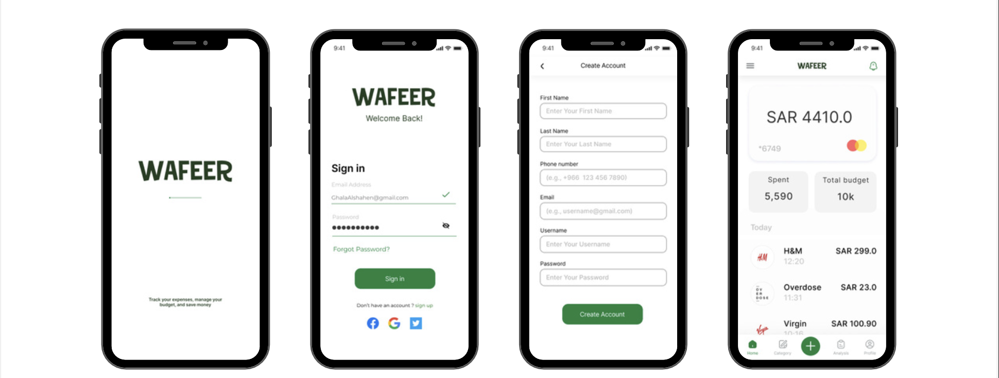
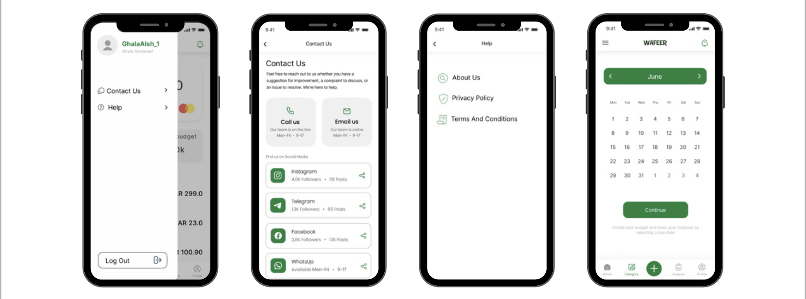
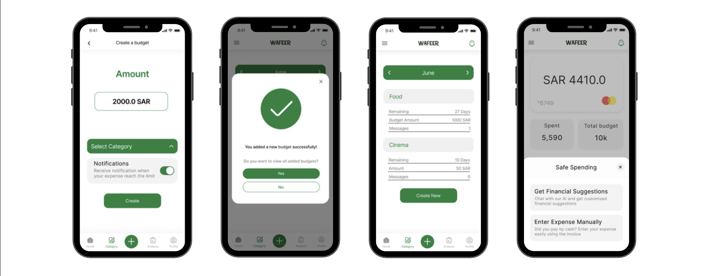
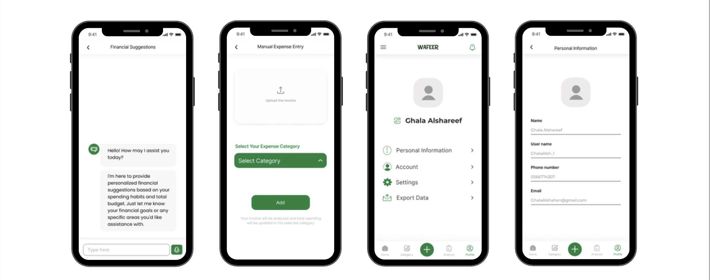
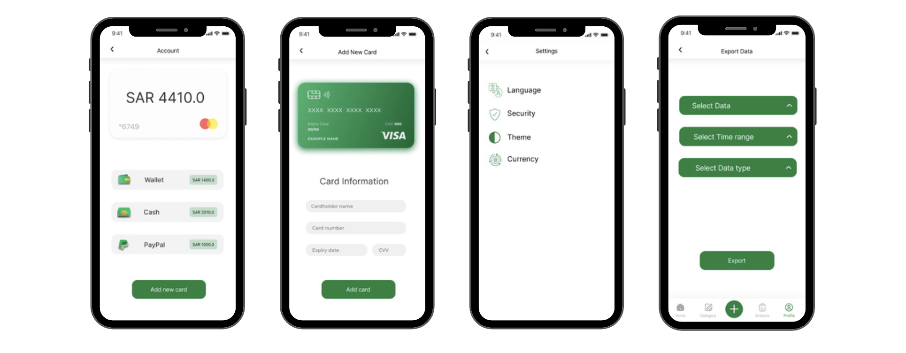
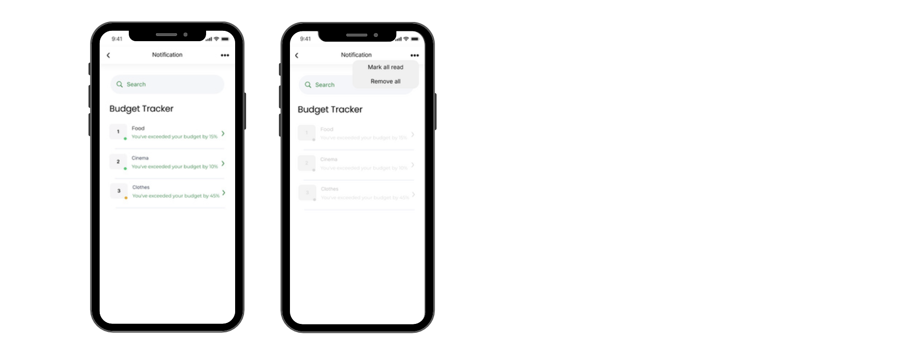

  

<h1 align="center">WAFFER APP</h1>

WAFEER is a financial management application designed to help users track their expenses, manage monthly budgets, and gain clear insights into their spending patterns.  
The project focuses on simplifying financial decision-making through intuitive design, data-driven insights, and AI-powered recommendations.

This system was developed after conducting extensive requirement gathering and usability research, including survey analysis, low- and high-fidelity prototyping, and user testing.  

---

## ✅ Problem Description
Many individuals struggle to monitor their income and expenses effectively, which leads to unclear spending patterns, difficulty identifying financial issues, and challenges in achieving personal financial goals.

Users also lack:
- Clear categorization of expenses  
- Tools to compare monthly spending  
- Personalized financial guidance  
- Alerts or predictions that help prevent overspending  

---

## ✅ Proposed Solution
Wafeer provides a **smart, user-friendly financial management platform** that includes:

- Automated expense tracking through ATM card integration  
- Expense categorization (food, transport, entertainment, etc.)  
- Monthly summaries and visual reports  
- Monthly expense comparison  
- Personalized financial suggestions based on user behavior  
- Alerts for reaching spending limits  
- Security-focused design for sensitive financial data  
- Prediction models for future expenses  
- Tools for planning and achieving financial goals  

Wafeer ultimately helps users understand their financial patterns, reduce unnecessary spending, and make informed decisions.

---

## ✅ Requirement Gathering

A structured questionnaire was distributed to collect both qualitative and quantitative data.  
Key findings:  
- **86.9%** use ATM cards regularly → opportunity for automated tracking  
- Many users struggle to determine monthly expenses  
- **93.4%** want an app connected to their ATM card  
- Strong interest in expense categorization  
- **96.7%** want detailed monthly summaries  
- Users desire monthly comparison of expenses  
- Demand for personalized recommendations  
- Emphasis on privacy, security, and early alerts  

---

## ✅ Functional Requirements (Summary)

### **User Management**
- Authentication  
- Profile management  

### **Expense Categorization**
- Custom categories  
- Predefined categories  
- Category-based spending summaries (monthly, quarterly, yearly)

### **Expense Tracking & Analysis**
- Import expenses from external sources  
- Generate monthly reports  
- Summaries per category  
- Visual charts and graphs  
- Compare this month vs. last month  

### **Manual Expense Entry**
- Add/Edit/Delete manual entries  
- Upload invoices for analysis  

### **Personalized Suggestions**
- Analyze income, expenses, savings  
- Provide spending optimization tips  
- Propose tailored budget plans  

### **Alerts & Reminders**
- Budget limit warnings  
- Customizable reminder frequency  
- Smart notifications based on user habits  

---

## ✅ Non-Functional Requirements
- High usability  
- Clear visual feedback  
- Helpful error messages  
- Light & dark mode options  
- Responsive and smooth interactions  
- Accessible UI design  

---

## ✅ Prototyping

### **Low-Fidelity Prototype**
Early sketches outlining core screens and user flows.

### **High-Fidelity Prototype**
A polished, interactive mockup designed in Figma, applying the Eight Golden Rules of Interface Design.

🎨 **Figma UI**:  
https://www.figma.com/design/vBACE9rvSVvl5njosVrHTP/Wafeer?node-id=0-1

---

## ✅ Usability Testing

**Method:** In-person, moderated testing  
**Goal:** Ensure users can complete required tasks easily  

### **Test Tasks**
1. Create a new budget (month + category + reminders)  
2. Enter expense manually (invoice upload + category)  
3. Ask chatbot for financial suggestions  
4. View analysis in PDF format  

### **Key Insights**
- Task 1: 0% error rate → very intuitive  
- Task 2: Some errors → invoice upload needs simplification  
- Task 3: Mostly successful → chatbot icon needs clearer visibility  
- Task 4: Highest error rate → PDF access placement unclear  

---

## 📱 User Interface (UI Screens)

Below are the main interface screens of the **WAFEER Application**, designed as part of the system’s high-fidelity prototype.

  

  

  

  

  

  

---

## ✅ Future Work
- Improve UI responsiveness and navigation  
- Add community-driven features and savings challenges  
- Advanced AI for spending prediction  
- Smarter alerts for bills and budget adjustments  
- Enhanced personalization and financial insights  

---

## ✅ Conclusion
Wafeer demonstrates strong potential in simplifying personal financial management.  
Through structured requirement analysis, prototyping, and user testing, the project delivered a clear, user-centered vision for an intelligent expense-tracking system.  
With further enhancements and predictive features, Wafeer can become a powerful tool to help users achieve financial stability and long-term savings.
